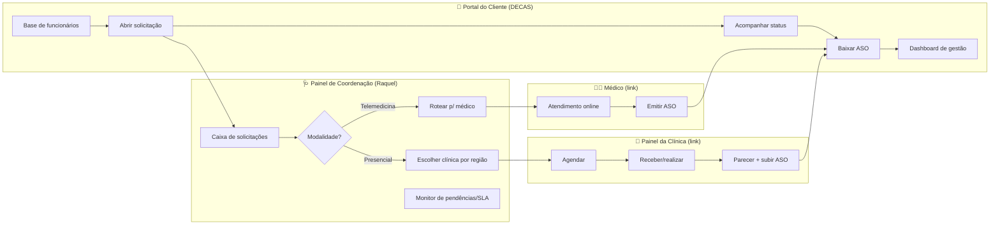
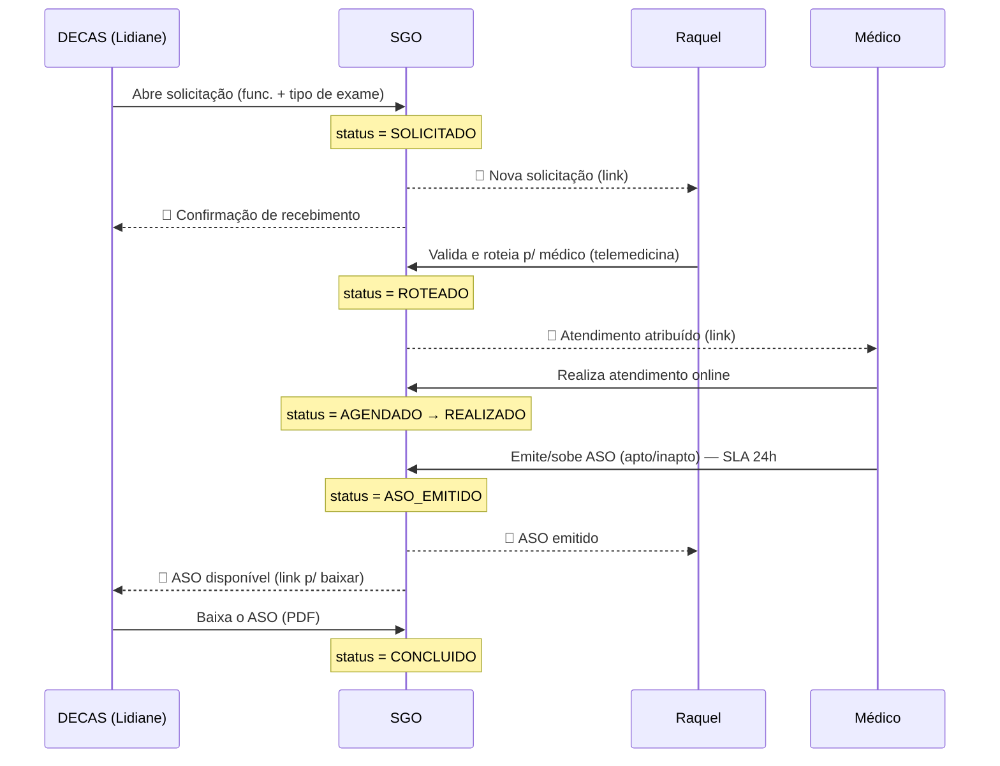
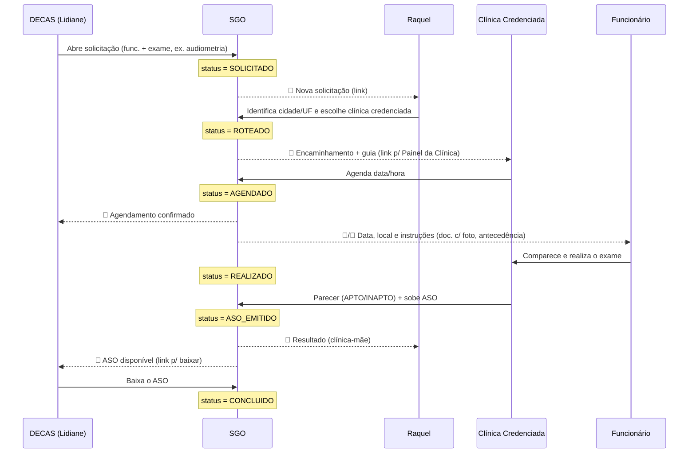
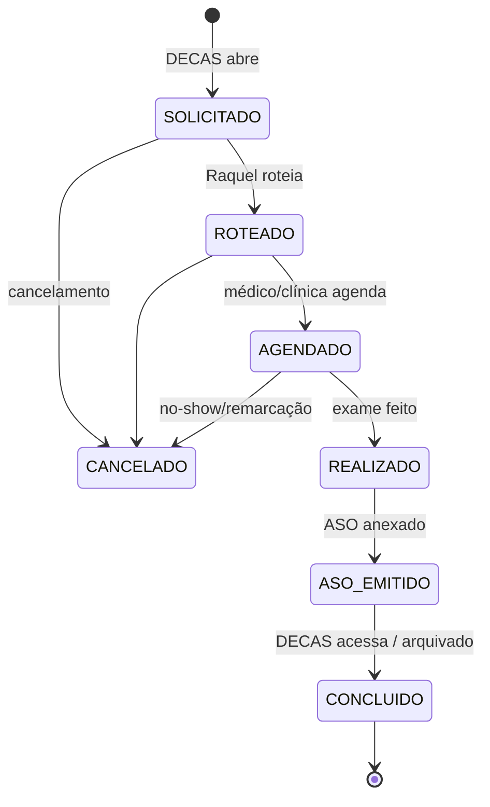

# Fluxo de Processo — Telas, Atores, Aprovações, Comunicação e Status

> Como o processo ocupacional roda no SGO ponta a ponta: quem faz o quê em cada tela, quem aprova,
> o que dispara cada comunicação e como o **status** do evento muda para cada pessoa.
> Modalidades: **Telemedicina** (~80%) e **Presencial**. Ciclo de status base:
> `SOLICITADO → ROTEADO → AGENDADO → REALIZADO → ASO_EMITIDO → CONCLUIDO` (+ `CANCELADO`).

---

## 1. Atores e suas telas

| Ator | Quem | Tela / acesso | Papel |
|---|---|---|---|
| **Cliente (DECAS)** | Lidiane / Mayara (RH/DP) | **Portal do Cliente** (login/senha) | Abre solicitação, acompanha, baixa ASO |
| **Coordenação (O+)** | Raquel ("clínica-mãe") | **Painel de Coordenação** | Valida, **roteia** (médico/clínica), monitora |
| **Médico (Telemedicina)** | Médico parceiro | **Link no e-mail** → tela do atendimento | Atende online, emite ASO |
| **Clínica Credenciada** | Clínica da região | **Link no e-mail** → Painel da Clínica | Agenda, atende presencial, dá parecer, sobe ASO |
| **SGO (sistema)** | — | orquestração | Notifica, gera PDF/boleto, atualiza status |

---

## 2. Visão geral (mapa de telas)

---

## 3. Fluxo Telemedicina (sequência + comunicação + status)

---

## 4. Fluxo Presencial (sequência + comunicação + status)

> **Importante:** no presencial o resultado volta para **Raquel e DECAS ao mesmo tempo** — a O+ é a
> "clínica-mãe" e precisa saber o `APTO/INAPTO` junto com o cliente.

---

## 5. Ciclo de vida do status (máquina de estados)

---

## 6. Matriz por etapa (tela · ator · ação · aprovação · status · comunicação)

| Etapa | Tela | Ator | Ação | Quem aprova | Status resultante | Comunicação disparada |
|---|---|---|---|---|---|---|
| 1. Solicitar | Portal Cliente | DECAS (Lidiane) | Seleciona funcionário + tipo de exame + exames | — | `SOLICITADO` | 📧 Raquel (nova) + 📧 DECAS (confirmação) |
| 2. Triagem/Roteamento | Painel Coordenação | **Raquel** | Valida dados, define modalidade e destino | **Raquel** | `ROTEADO` | 📧 Médico **ou** 📧 Clínica (com link) |
| 3a. Agendar (presencial) | Painel da Clínica | Clínica | Define data/hora | Clínica | `AGENDADO` | 📧 DECAS + 📧/📱 Funcionário (instruções) |
| 3b. Atender (telemed.) | Link do médico | Médico | Atende online | Médico | `AGENDADO`→`REALIZADO` | — |
| 4. Realizar | Painel da Clínica | Clínica/Funcionário | Comparecimento + exame | — | `REALIZADO` | — |
| 5. Parecer + ASO | Clínica/Médico | **Médico** | `APTO/INAPTO` + sobe ASO (SLA 24h telemed.) | **Médico** | `ASO_EMITIDO` | 📧 Raquel + 📧 DECAS (link p/ baixar) |
| 6. Encerrar | Portal Cliente | DECAS | Baixa o ASO | — | `CONCLUIDO` | registro no histórico |
| ⚠️ Exceção | qualquer | Raquel/Clínica | Cancelar/remarcar | Raquel | `CANCELADO`/volta a `ROTEADO` | 📧 envolvidos |

---

## 7. Pontos de aprovação (gates)
1. **Raquel** — gate operacional: nenhuma solicitação avança sem ela validar/rotear (etapa 2).
2. **Médico / Clínica** — gate clínico: o `APTO/INAPTO` é a decisão técnica que fecha o evento (etapa 5).
3. **DECAS** — não aprova; **consome** o resultado (baixa o ASO, etapa 6).

---

## 8. Régua de comunicação (quem recebe o quê, e quando)

| Gatilho (mudança de status) | DECAS | Raquel | Médico | Clínica | Funcionário |
|---|:--:|:--:|:--:|:--:|:--:|
| `SOLICITADO` (criada) | ✅ confirmação | ✅ nova | — | — | — |
| `ROTEADO` (telemedicina) | — | ✅ | ✅ link | — | — |
| `ROTEADO` (presencial) | — | ✅ | — | ✅ link+guia | — |
| `AGENDADO` (presencial) | ✅ | ✅ | — | — | ✅ instruções |
| `ASO_EMITIDO` | ✅ link | ✅ | — | — | — |
| `INAPTO` (parecer) | ✅ alerta | ✅ alerta | — | — | — |
| SLA estourado (ex.: 24h) | — | ✅ pendência | ✅ lembrete | ✅ lembrete | — |

Canais: **e-mail** (toda etapa, com link de ação) + **portal/dashboard** (tempo real) +
**WhatsApp/SMS** opcional para o funcionário (instruções de comparecimento).

---

## Documentos relacionados
- `spec-guia-unificada.md` — campos do formulário que abre o fluxo
- `regras-pcmso-eventos.md` — o que dispara cada tipo de evento
- `ANALISE-MATERIAIS-E-AUTOMACAO.md` — visão geral e materiais
- `DEMANDA-Produto3-Gestao-Ocupacional.md` — demanda do Produto 3
